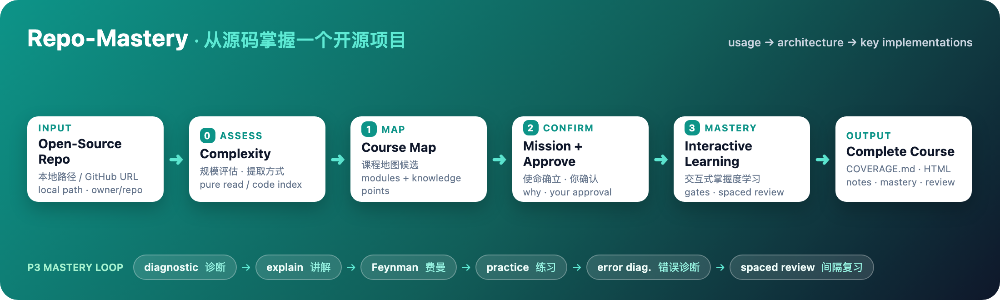

<div align="center">

# 📚 Repo-Mastery

**把任意开源仓库变成开发者视角的掌握式课程。**

像学一门真实课程一样，掌握一个项目的 **使用 → 架构 → 关键实现** —— 有经你确认的课程地图、确定性掌握度闸门、间隔重复，以及 Markdown + HTML 双形态的课程产出。

[](LICENSE)
[](#)


[English](./README.md) · [文档](./docs/zh-CN/ARCHITECTURE.md) · [贡献指南](./CONTRIBUTING.md)

</div>

<p align="center">
  
</p>

---

## 目录

- [这是什么？](#这是什么)
- [为什么](#为什么)
- [特性](#特性)
- [工作原理](#工作原理)
- [安装](#安装)
- [使用](#使用)
- [命令](#命令)
- [数据模型](#数据模型)
- [项目结构](#项目结构)
- [文档](#文档)
- [贡献](#贡献)
- [许可](#许可)
- [致谢](#致谢)

---

## 这是什么？

Repo-Mastery 是一个 **Agent skill**，把任意开源仓库转成结构化的、面向开发者的掌握式课程。给定本地仓库路径或 GitHub URL，它：

1. **客观预扫描**代码库，提出**课程地图**（模块 + 知识点）。
2. 由**你确认并定制**课程地图 —— 与你的 **Mission**（为什么想掌握这个仓库）对齐。
3. 驱动**交互式掌握度学习** —— 诊断 → 讲解 → 费曼检验 → 练习 → 错误诊断 → 间隔复习。
4. **持久化**进度、笔记与**学习记录**，支持跨会话续学。
5. 合成**完整课程文档**（Markdown + HTML，可分享）。

它是 `docs-to-course`（教终端用户怎么用工具）的深度进阶版：Repo-Mastery 教开发者一个项目是**怎么被构建的**。

## 为什么

作为开发者，读完一个开源项目的代码，往往不等于"掌握"。Repo-Mastery 用一套可判定的学习机制弥合这个差距：

- 每个知识点都有**确定性掌握度闸门** —— 不是 LLM 的主观印象。
- **间隔重复**对抗遗忘；**学习记录**捕捉你的理解如何演化。
- 笔记与进度**跨会话持久化**，随时精确续学。

## 特性

- 🗺️ **基于证据的课程地图** —— 每个模块/知识点都指向真实文件、目录与调用链。
- 🧭 **Mission 驱动** —— 扎根于"为什么想学"，而不是泛泛覆盖。
- ⚖️ **双轨掌握度闸门** —— 定量（近因加权准确率 ≥ 0.9）用于使用/操作；定性（费曼复述）用于概念/架构。
- ⏳ **间隔重复** —— 每种类型独立间隔序列，错题提升优先级。
- 🔧 **动手验证** —— 命令经你批准后运行；procedure 知识点必须有真实证据才算掌握。
- 📝 **持久笔记 + ADR 式学习记录** —— 自动沉淀 + 手动追加；记录追踪理解演化并支持 supersession。
- 🌍 **自适应提取** —— 中小仓库直接读；大型仓库用轻量 Python 索引（`code-map.json`）。
- 📦 **双形态产出** —— 全量 Markdown 课程（`COVERAGE.md`）+ 可分享的交互式 HTML 课程。
- 🌐 **双语** —— 讲解语言跟随你的输入；代码与标识符保持原文。
- 🧰 **多 CLI 支持** —— 同一 skill 原生运行于 **Claude Code、OpenAI Codex、Gemini CLI** 及遵循 AGENTS.md 的工具。确定性闸门是真代码（`scripts/learning_engine.py`），所有工具共用，掌握度数学永不错位。

## 工作原理

```text
Phase 0  复杂度评估        →  决定提取方式（纯读 / Python 索引）
Phase 1  客观预扫描        →  课程地图候选
Phase 2  Mission + 地图确认 →  你批准/定制（强制步骤）
Phase 3  交互式掌握度学习（诊断 → 讲解 → 费曼 → 练习 → 错误诊断 → 间隔复习）
Phase 4  合成 COVERAGE.md + 可选可分享 HTML 课程
```

核心设计公理：**智能在出口，进阶在闸门** —— 模型决定教什么，但能否进阶永远是确定性引擎判定。

## 安装

本仓库**本身就是**这个 skill，遵循开放的 **Agent Skills 标准**（agentskills.io）——同一份 `SKILL.md` 原生运行于 Claude Code、OpenAI Codex、Gemini CLI。**五种安装方式，任选其一：**

### 1. npm —— 一条命令

```bash
npx @dieselzhang/repo-mastery install            # 任意工具、任意位置
# 或全局安装 CLI：
npm i -g @dieselzhang/repo-mastery && repo-mastery install
# 选项：repo-mastery install --only codex / --skip gemini / --dry-run
```

### 2. curl —— 一行，无需 npm

```bash
curl -fsSL https://raw.githubusercontent.com/DieselZhang/repo-mastery/main/scripts/install.sh | bash
```

安装到 Claude Code + Codex + Gemini。管道后加 `--only codex`（等）可选。

### 3. Claude Code —— 原生插件安装

```bash
claude plugin marketplace add DieselZhang/repo-mastery
claude plugin install repo-mastery@repo-mastery
```

（会话内等价：`/plugin marketplace add …` 然后 `/plugin install …`。）

### 4. 对话安装 —— 让 CLI 自己装

| 工具 | 对它说 |
|---|---|
| **Claude Code** | "把 github:DieselZhang/repo-mastery 的 repo-mastery skill 安装到 ~/.claude/skills"（Claude 会 clone + 放置），或走上面的 `/plugin` 路线 |
| **OpenAI Codex** | 在 Codex 里用内置安装器：`$skill-installer install https://github.com/DieselZhang/repo-mastery` |
| **Gemini CLI** | "把 github:DieselZhang/repo-mastery 的 repo-mastery skill clone 到你的 skills 目录" |

### 5. 手动 —— clone

```bash
git clone https://github.com/DieselZhang/repo-mastery ~/.claude/skills/repo-mastery
cd repo-mastery && ./scripts/install.sh    # 从 checkout 安装到其他工具
```

### 各工具查找位置

| 工具 | skill 目录 | 入口 |
|---|---|---|
| **Claude Code** | `~/.claude/skills/` | `SKILL.md` —— `/repo-mastery start <仓库>` |
| **OpenAI Codex** | `~/.codex/skills/`（或 `~/.agents/skills/`） | `SKILL.md` + `agents/openai.yaml` |
| **Gemini CLI** | 其 skills 目录（`GEMINI_SKILLS_DIR` 可覆盖） | `activate_skill` / `GEMINI.md` |
| **opencode / Cursor**（AGENTS.md 工具） | 项目目录 | `cp AGENTS.md <项目>/AGENTS.md` |

> **Codex 注意**：Codex 只读自己的目录，不读 `~/.claude/`。请安装到 `~/.codex/skills/` 才会被发现。安装后重启 CLI。
>
> **插件注意**：以插件方式安装会把 skill 缓存到 `~/.claude/plugins/cache/`，调用为带命名空间的形式（`/repo-mastery:repo-mastery`）。

**环境要求**

- 目标仓库：本地路径，或可访问的 `github:owner/repo`（skill 自动 `git clone --depth 1`）。
- Python 3.8+ —— 确定性引擎（`scripts/learning_engine.py`）与大型仓库索引（`scripts/index_repo.py`）需要，均纯标准库。

## 使用

```bash
/repo-mastery start <本地路径 | github:owner/repo> [--language zh|en]
```

示例 —— 从 GitHub URL 学一个项目：

```bash
/repo-mastery start github:DieselZhang/repo-mastery
```

skill 会带你走完四个阶段。讲解语言默认跟随你的输入；传 `--language zh` / `--language en` 可强制指定。

## 命令

| 命令 | 作用 |
|---|---|
| `/repo-mastery start <路径\|url>` | 主流程：地图 → 确认 → 学习 → 产出 |
| `/repo-mastery continue` | 续学上次进度（回到 `next_objective`） |
| `/repo-mastery review` | 间隔复习会话（到期项） |
| `/repo-mastery note "<文本>"` | 手动向当前模块笔记追加 |
| `/repo-mastery status` | 查看进度（地图摘要风格） |
| `/repo-mastery report` | 生成掌握度报告 `MASTERY.md` |
| `/repo-mastery export [--html]` | 合成完整课程文档（`COVERAGE.md`；`--html` 额外生成可分享 HTML 课程） |

## 数据模型

```text
<目标仓库>/.learning/          ← 随仓库走；自动 gitignore
  ├── MISSION.md              学习使命（为什么想掌握它）
  ├── course-map.json         已确认的课程地图
  ├── progress.json           掌握度 / 间隔复习 / 卡点
  ├── records/NNNN-slug.md    ADR 式学习记录（理解演化）
  ├── notes/<module>.md       结构化笔记（自动 + 手动）
  ├── briefs/<module>.md      模块简报（大型仓库省 token）
  └── code-map.json           大型仓库索引（可选）
~/.repo-mastery/              全局轻量记忆
  ├── profile.md              跨仓库偏好 / 水平 / 卡点
  └── index.json              学过的仓库 + 续学状态
```

## 项目结构

```text
repo-mastery/
├── SKILL.md                        skill 定义（英文；Agent Skills 标准）
├── README.md                       本文件（英文）
├── README.zh-CN.md                 中文镜像
├── ADOPTION.md                     归属声明：DeepTutor / docs-to-course / teach
├── CONTRIBUTING.md                 贡献指南
├── AGENTS.md                       遵循 AGENTS.md 工具（Codex/opencode/Cursor）的协议
├── GEMINI.md                       Gemini CLI 的协议
├── LICENSE                         MIT
├── package.json                    npm 打包（`repo-mastery install` 一条命令安装）
├── .claude-plugin/                 Claude Code 插件 marketplace + plugin 清单
│   ├── marketplace.json
│   └── plugin.json
├── agents/
│   └── openai.yaml                 Codex / Agent-Skills UI 元数据
├── bin/
│   └── repo-mastery.js             npm 一条命令安装器
├── scripts/
│   ├── learning_engine.py          确定性闸门（掌握度/排期/记录/下一步/校验/初始化）
│   ├── index_repo.py               大型仓库代码索引（纯标准库）
│   └── install.sh                  一键安装到 Claude Code + Codex + Gemini（也支持 curl 管道）
├── references/                     skill 内部文件（按阶段读取）
│   ├── curriculum-design.md        从源码设计课程地图
│   ├── mastery-policy.md           掌握度 / 闸门 / 间隔复习 / 错误诊断
│   ├── session-flow.md             交互式学习协议（Mission + ZPD）
│   ├── quiz-design.md              测验设计（测应用不测记忆）
│   ├── module-brief-template.md    模块简报（预提取源码片段）
│   ├── note-template.md            笔记格式
│   ├── learning-records-template.md ADR 式学习记录
│   ├── gotchas.md                  失败点清单
│   ├── index-script-spec.md        索引脚本说明
│   └── html-shell/                 HTML 课程外壳（复制自 docs-to-course）
└── docs/
    ├── ARCHITECTURE.md             设计与架构（英文）
    ├── USAGE.md                    使用指南（英文）
    └── zh-CN/                      中文镜像
```

## 文档

- [架构设计](./docs/zh-CN/ARCHITECTURE.md) —— 设计、掌握度引擎、各阶段、数据模型。
- [使用指南](./docs/zh-CN/USAGE.md) —— 详细命令参考与学习流程。
- [采纳与归属](./ADOPTION.md) —— 本 skill 从 DeepTutor、docs-to-course、teach skill 吸收了哪些设计。

## 贡献

欢迎贡献。参见 [CONTRIBUTING.md](./CONTRIBUTING.md)。

## 许可

[MIT](./LICENSE) © 2026 DieselZhang。

## 致谢

- **掌握度引擎** 移植自 [DeepTutor](https://github.com/HKUDS/DeepTutor)（HKUDS，MIT）—— 确定性闸门、间隔重复、错误诊断、`explore_context` 预扫描。
- **课程设计与 HTML 外壳** 吸收自 `docs-to-course`（codebase-to-course）。
- **学习机制**（Mission、ZPD、学习记录、fluency vs storage）吸收自 [mattpocock-skills](https://github.com/mattpocock) 的 `teach` skill。

逐条归属说明：[ADOPTION.md](./ADOPTION.md)。
